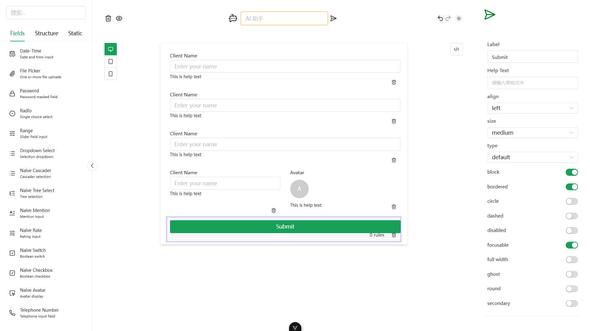
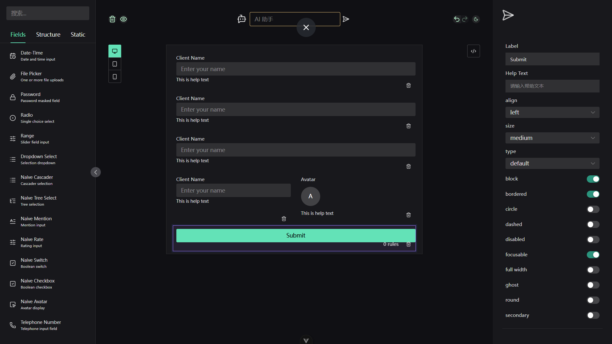
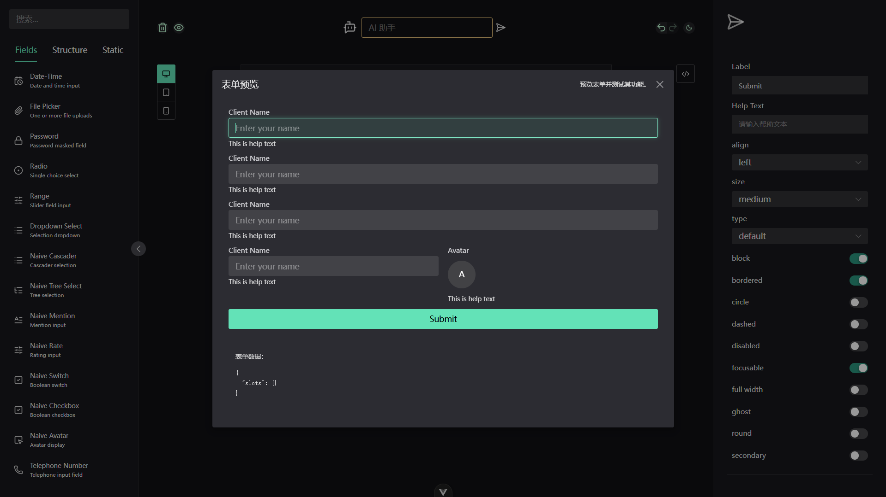

# formkit-form-builder

A visual FormKit schema builder for Vue 3.

The builder provides a three-panel interface: a component palette on the left, a form canvas in the center, and a property editor on the right. It supports drag-and-drop form composition, validation setup, preview, import/export, and optional AI-generated schemas.

For notes about installing this fork into another Vue project, see [HOWTOIMPORT.md](./HOWTOIMPORT.md).

## Installation

```bash
pnpm i @zeng-alt/formkit-form-builder
```

This package expects the host Vue project to provide the main Vue/FormKit UI runtime dependencies:

```bash
pnpm i vue @formkit/vue naive-ui @vueuse/core
```

## Styles

Import the package stylesheet once in your application entry:

```ts
import '@zeng-alt/formkit-form-builder/style.css'
```

## Quick Start

### 1. Install and register FormKit

Example for Vite + Vue 3:

```ts
// main.ts
import { createApp } from 'vue'
import { plugin as formkitPlugin } from '@formkit/vue'
import App from './App.vue'
import formkitConfig from './formkit.config'

createApp(App).use(formkitPlugin, formkitConfig).mount('#app')
```

### 2. Use FormBuilder

```vue
<script setup lang="ts">
import { BuilderProvider, FormBuilder } from '@zeng-alt/formkit-form-builder'
import '@zeng-alt/formkit-form-builder/style.css'

const config = {
  locale: 'en',
  aiAssistant: false,
  enabledFields: [
    // Available field ids:
    // 'text', 'textarea', 'email', 'number', 'url', 'checkbox', 'color',
    // 'date', 'time', 'naiveDateTime', 'file', 'password', 'radio',
    // 'range', 'select', 'naiveCascader', 'naiveTreeSelect', 'naiveMention',
    // 'naiveRate', 'naiveSwitch', 'naiveAvatar', 'naiveImage', 'tel',
    // 'naiveButton', 'submit', 'reset', 'list', 'card', 'inputGroup', 'tabs',
    // 'naiveText', 'naiveP', 'naiveA', 'naiveBlockquote', 'naiveH1',
    // 'naiveH2', 'naiveH3', 'naiveH4', 'naiveH5', 'naiveH6',
    // 'naiveUl', 'naiveOl', 'naiveLi', 'naiveDivider', 'naiveAlert',
    // 'naiveBackTop'
    'text',
    'textarea',
    'number',
    'date',
    'select',
    'radio',
    'checkbox',
    'file',
  ],
  enabledValidations: [
    // Defaults matching the basic validation set:
    // Required -> 'required'
    // String -> 'alpha_spaces' (closest available text validation)
    // Number -> 'number'
    // Date -> 'date_format'
    // Min / Max -> 'min', 'max'
    //
    // Available validation ids:
    // 'accepted', 'required', 'email', 'number', 'lowercase', 'uppercase',
    // 'url', 'alpha', 'alpha_spaces', 'alphanumeric', 'symbol',
    // 'contains_alpha', 'contains_alphanumeric', 'contains_alpha_spaces',
    // 'contains_symbol', 'contains_uppercase', 'contains_lowercase',
    // 'contains_numeric', 'confirm', 'min', 'max', 'matches',
    // 'starts_with', 'ends_with', 'date_after', 'date_before',
    // 'date_format', 'is', 'not', 'require_one', 'date_between',
    // 'length', 'between'
    'required',
    'alpha_spaces',
    'number',
    'date_format',
    'min',
    'max',
  ],
  apiKey: '',
}
</script>

<template>
  <BuilderProvider :config="config">
    <FormBuilder />
  </BuilderProvider>
</template>
```

## API

### Exports

```ts
import {
  FormBuilder,
  BuilderProvider,
  BuilderPreview,
  FormSchemaRenderer,
  FormBuilderProvider,
  useFormBuilderConfig,
  provideFormBuilderConfig,
} from '@zeng-alt/formkit-form-builder'
```

- `FormBuilder`: Main builder UI component.
- `BuilderProvider / FormBuilderProvider`: Global configuration provider. These are aliases for the same component.
- `FormSchemaRenderer`: Public form renderer for schemas produced by the builder.
- `BuilderPreview`: Reusable modal preview component built on top of `FormSchemaRenderer`.
- `useFormBuilderConfig / provideFormBuilderConfig`: Low-level configuration injection helpers. In most cases, use `BuilderProvider`.

### Form Rendering

```vue
<script setup lang="ts">
import { ref } from 'vue'
import { FormSchemaRenderer } from '@zeng-alt/formkit-form-builder'

const schema = ref([])
const data = ref({})
</script>

<template>
  <FormSchemaRenderer
    :schema="schema"
    v-model="data"
    @submit="(value) => console.log(value)"
  />
</template>
```

### FormBuilderConfig

```ts
export interface FormBuilderConfig {
  apiKey?: string
  aiAssistant?: boolean
  enabledFields?: readonly FormBuilderFieldName[]
  enabledValidations?: readonly FormBuilderValidationName[]
  locale?: string
  messages?: Record<string, any>
}
```

- `apiKey`: Optional. Required only when the AI assistant is enabled and calls OpenAI.
- `aiAssistant`: Optional. Defaults to `false`. Set to `true` to lazy-load and show the AI assistant.
- `enabledFields`: Optional. Defaults to `text`, `textarea`, `number`, `date`, `select`, `radio`, `checkbox`, and `file`.
- `enabledValidations`: Optional. Defaults to `required`, `alpha_spaces`, `number`, `date_format`, `min`, and `max`.
- `locale`: Optional. Defaults to `en`.
- `messages`: Optional i18n overrides. The structure should match the default messages object.

## i18n Overrides

```ts
const config = {
  locale: 'en',
  messages: {
    en: {
      builder: {
        clearForm: 'Clear the current form',
      },
    },
  },
}
```

## Screenshots





## Publishing to npm

1. Check `package.json`:

- `name` is available and matches your intended package name.
- `version` has been updated using semver.
- `publishConfig.access` is set to `public`.
- `private` is not set.

2. Install dependencies and build the package:

```bash
pnpm install --no-frozen-lockfile
pnpm build
```

3. Log in and publish:

```bash
npm login
npm publish --access public
```

If you use pnpm:

```bash
pnpm publish --access public
```

## Development

```bash
pnpm install
pnpm dev

pnpm version patch
pnpm version minor
pnpm version major
pnpm publish
```
